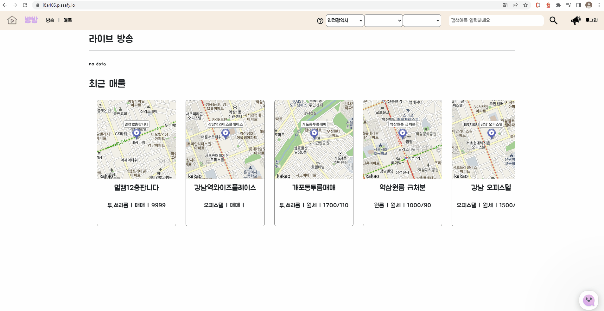
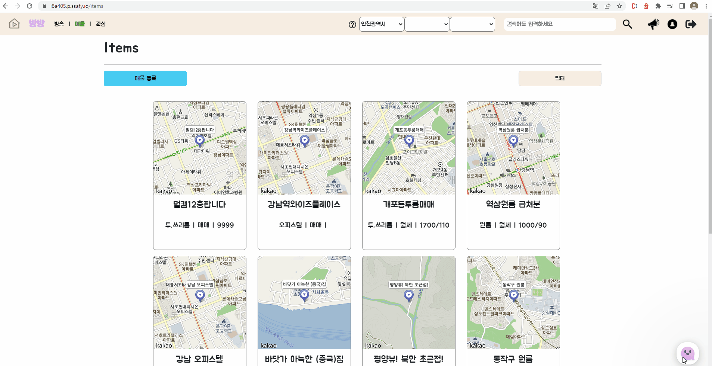
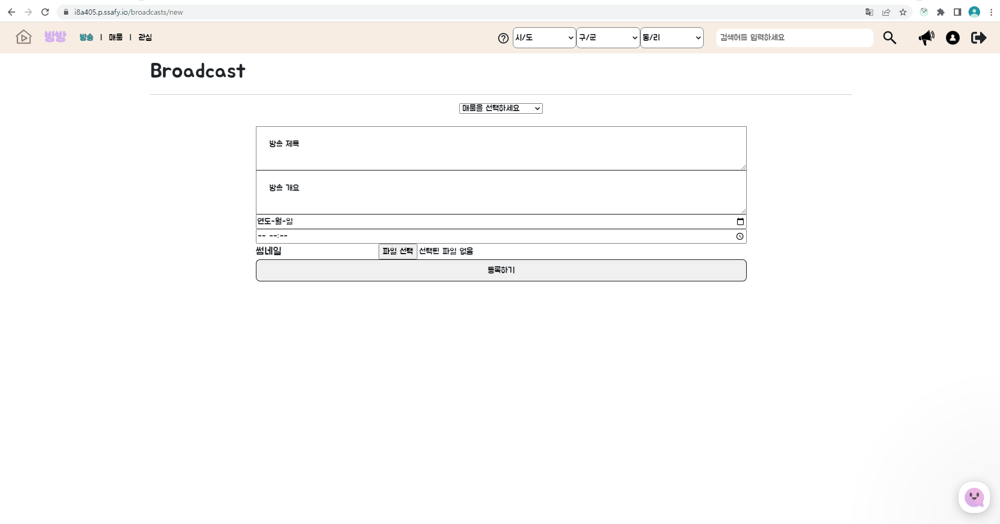

# 🏢 BangBangBwa ( 어디서든 실시간으로 집 매물을 볼 수 있는 부동산 라이브 커머스)

## 🏚방방봐 소개 🏚
중개사가 등록한 매물을 토대로 방송을 등록하면 호스트와 시청자로 구분하여 실시간으로 집 매물을 확인할 수 있는 서비스

## ✨Overview
집을 구할 때 이리저리 돌아다녀야 해서 힘드셨죠? 사진으로만 괜찮은 집인지 아닌지 판단하기 힘드셨죠? 그래서 준비했습니다!!!! 방방봐 서비스~~!

## ✨방방봐의 모토
`빠르게 집을 구하기위해 어디서든 실시간으로 집을 확인하고 집보러 가는 시간을 절약하자!`

## 🕑프로젝트 기간
2023.01.03 ~ 2023.02.17

## ✨ 주요 기능

- 서비스 설명 : 어디서든 실시간으로 집 매물을 볼 수 있는 부동산 라이브 커머스
- 주요 기능 :
    - webRTC를 통한 실시간 라이브커머스
    - 일반 사용자가 중개사 등록 승인이 되면 매물 등록 및 방송 등록 가능
    - 진행중인 방송이나 방송 예정인 매물 방송 카테고리 보여줌

### 🖥️ 사용 기술

**Backend - Spring**

- JAVA → v8
- JDK → v1.8
- mysql → v8.0.21
- spring boot → v3.0.1

**CI/CD**

- AWS EC2
- Jenkins
- NGINX
- SSL

**Frontend**

- Node.js → v16.0.0 (Openvidu 사용으로 인한 version 다운그레이드)
- react → v18.2.0
- Openvidu → 2.19.0
- npm → v7.10.0
- redux : v4.2.0
- @reduxjs/toolkit : v1.9.1
- react-redux : v8.0.5
- redux-persist : v6.0.0

## 💪🏻 성장한 점

- 회원 인증, 인가 구현
    - Spring Security를 사용하여 Jwt를 사용하고 인증, 인가 부분을 제대로 처리할 수 있었습니다.

- ORM 사용
    - JPA를 사용함으로써 ORM을 학습하고 특징, 장단점 등에 대해 학습하고 이해하는 시간이었습니다.
      
- 자동배포
    - AWS EC2, Docker, Jenkins를 사용해 자동배포를 경험해 볼 수 있는 시간이었습니다.
    - Nginx, CertBot으로 HTTPS로 배포해보는 경험해 볼 수 있는 시간이었습니다.

## 🙏🏻 아쉬운 점(개선하고 싶은 점)

- 기능 구현
    - 기간, 능력을 고려하지 않고 기술을 선정하여 기획했던 모든 기능들을 구현하지 못한것이 아쉽습니다.

- N+1 문제 해결
    - 여러가지 Join이 발생하여 N+1이 발생했으나 정확히 해결하지 못한점이 아쉬웠습니다.(추후 공부후 수정)

## BangBangBwa 서비스 화면

### 🧩 로그인과 회원가입

### 🧩 매물등록

### 🧩 매물 상세조회

### 🧩 방송등록

### 🧩 방송시작

### ✨ EC2 포트 정리
---
|**PORT**|**이름**|
|:---:|:---:|
|443|HTTPS|
|80|HTTP - HTTPS로 리다이렉트(프론트 페이지지로 리다이렉트)|
|8086|Openvidu|
|43306|MySQL|
|9090|Jenkins|
|8081|Spring boot Docker Container|
|3000|React, NginX Docker Container|

